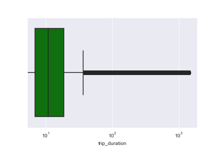

Can AirBnB Data Enhance Taxi Ride Profitability Classification?
===============================================================

Background Information
----------------------

In a buzzing metropolis such as New York City, an understanding of
transport activity and spending is forever sought after. Ever since the
release of the New York Taxi and Limousine Commission's Trip Record
Data, as part of the NYC Open Data Project[1], many
analyses have been carried out to investigate taxi demand
[2], supply [3], and revenue [4]. This
report however, sets out to investigate spending through both taxi trip
data, and accommodation listing data from rental company AirBnB. Through
such analysis, the report aims to determine whether it would be
profitable for taxi companies and green and yellow taxi drivers to
purchase AirBnB data to improve the classification of ride
profitability.

The Data
--------

### AirBnB Dataset

The AirBnb data from this analysis was sourced from Inside AirBnB
[5] and covers all the listings in New York city, with their
location, description, and other metrics. It contains data about
listings from 2019, with the last recorded review date in the data being
in July. The data set covers around 50'000 listings, with 15 different
metrics from each listing.

### NYC TLC Dataset

The taxi data was sourced from the New York Taxi and Limousine
Commission ('TLC') Trip Record database [6], from May 2019 to
July 2019. These dates were chosen since they lined up most accurately
with the AirBnB data. Furthermore, this time was the busiest for NYC in
terms of tourism[7] and is therefore the most appropriate to
use in conjunction with AirBnB data. The three months of data records
approximately 22 million trips, with each trip having 18 different
features.

Yellow and green taxis will be studied in this report. This is because
the area covered is much greater than just yellow taxis, which therefore
broadens the applications of our model. For-Hire-Vehicles were not
considered as fare amount data was not included in their data set.

### NYC TLC Taxi Zone Dataset

Geographical data was also sourced from TLC [8], outlining the
taxi zones used to describe each trip's pick up and drop off point.
There are 263 valid zones.

Chosen Attributes
-----------------

The attribute that is being classified in our machine learning model is
trip profitability (see equation 1). Our model will classify a trip's
profitability based on driving factors and factors from the AirBnB data.

The driving factors are as follows:

-   The duration of the trip

-   The hour in which the passenger is going to be picked up for the
    trip

-   The probability of the given trip being requested

-   The probability of finding a trip in the zone in which you drop off
    the passenger

-   The borough from which the passenger is picked up

-   The borough at which the passenger is dropped off

The duration of a trip will not be known exactly by a driver when
classifying possible trip profitability prior to a trip. For the purpose
of this model, we are assuming that taxi drivers can predict trip
duration. Each trip will also be classified using AirBnB metrics from
the listings in the trip pick up zone and drop off zone. These metrics
are:

-   Number of zone listings

-   Median listing price

-   Median number of minimum nights of a listing

-   Median number of reviews

-   Median number of reviews per month

Metrics
=======

Trip Profitability Rate
-----------------------

When calculating the profitability of a given ride we need to consider
three factors:

1.  The difference in the fare amount and the resource cost of the trip

2.  How likely a trip from that zone at that hour is (e.g. a singular
    long trip far away from the city at an odd hour may be profitable,
    but this does not mean there will always be profitable rides in that
    area)

3.  The taxi demand in that zone, at that hour (e.g. a trip is not
    profitable if the next pick up destination is far away)

Combining these factors, the following equation was used to calculate
the profitability *P*, of a given ride *r*, going from a given zone
** to a given zone ** at time *t*:

Where CPM (Driving Cost Per Mile) = $0.58, as defined by the IRS
[9], and the expected Zone Demand of a given zone *Z*, at time *T* is
given by:

And d  D are the days in the given dataset

Preprocessing
=============

NYC TLC Dataset
---------------

The pre-processing steps for the taxi data were as follows:

1.  Only take trips with a valid Vendor ID (either 1 or 2)

2.  Drop trips completed before May 1 2019, and trips started after June
    30 2019

3.  Drop trips with negative trip distance, and trips with a distance in
    the top 0.1% to ensure the classifier does not learn on outliers
    (see figure 1)

4.  Only take trips with a RateCodeID equal to 1 or 2. This is because
    negotiated fairs/group rides are harder to predict, and should not
    be a factor in predicting profitability. Secondly, trips to/from
    Newark, Nassau, or Westchester are not considered due to their
    rarity in comparison to standard/JFK trips

5.  Only take trips with a valid `PULocation` and `DOLocation` (1
    to 263)

6.  Drop all trips with negative fare. This is because these trips will
    skew profitability, and predicting negative fare rides is not the
    focus of this report

7.  Only take trips paid with credit card avoid learning on outliers
    (e.g. 'Dispute' or 'No charge') and to ensure accuracy of tip data,
    as tips are only recorded for credit card payments

8.  Create column `trip_duration` from finding the difference in pick up
    and drop off times

9.  Remove trips longer than 2.5 hours as they are outliers (see
    figure 2)

10. Create columns `pu_hour` and `do_hour`, corresponding to the hours
    in which the passenger is picked up and dropped off

11. Create columns `pu_zone_hourly_demand` and `do_zone_hourly_demand`
    according to the equation (2)

12. Create column `trip_profit_rate` according to equation (1)

13. Create column `profit_label` according to the bin the trip's profit
    rate belongs to. The profit rates are placed into three equal
    frequency bins of low, medium and high profitability (labelled 1, 2,
    and 3 respectively)

The final dataset contained approximately 14 million rows, with each
trip having 14 different features. Choosing credit card trips was the
most notable cause of reduction, reducing the data set by 29%.

| |  |
|:---:|:---:|
| Figure 1: Distribution of trip distance before cleaning| Figure 2: Distribution of trip duration before cleaning |

AirBnB Dataset
--------------

The pre-processing steps for the AirBnB data were as follows:

1.  Create column `ABLocationID` by assigning every listing with a taxi
    zone location according to the TLC Taxi Zone shapefile [8]

2.  Fill missing values in `reviews_per_month` with 0

3.  Round values in `minimum_nights` to the nearest integer

4.  Group the data set by `ABLocationID`, to obtain number of listings
    per zone, and other metrics as specified in section 1.3

The final data set contained 242 rows, each corresponding to a specific
zone (not all zones contained AirBnB listings). Each zone had 6
features.

Preliminary Analysis - Factors Affecting the Model
==================================================

Time of Pick Up
---------------

The first variable effecting the profitability of a ride, is the time
that the passenger is picked up. We can see that this data has two major
peaks around 8:00am and 5:00pm - 7:00pm, most likely the times at which
civilians are going to or coming from work. Trip demand may be higher at
these times, and therefore trips may be more profitable as taxi drivers
would not have to wait as long (i.e. Zone Hourly Demand is higher)

Trip Duration
-------------

The distribution of trip profitability, on a log scale, looks to be
right skewed. This is due to the high volume of short taxi trips, most
likely in the Manhattan. This may cause the model to predict better on
trips which have a lower trip distance, as opposed to longer trips.

| | |
|:---:|:---:|
| Figure 3: Distribution of trip pick up times| Figure 4: Distribution of trip duration |

| |  |
|:---:|:---:|
| Figure 5: Choropleth map of the number of listings per NYC Taxi Zone | Figure 6: Choropleth map of the median price of listings per NYC Taxi Zone |

Number of Listings and Median Price
-----------------------------------

The number of listings per taxi zone (Figure 5) may effect how many
tourists visit that area, or how many AirBnB residents (who are not
likely to have access to a car) will need rides from that zone. In
Figure 5 we see the popular areas are around Brooklyn, with the most
listing-dense zone being Bushwick South (see marker), having 1769 AirBnB
listings. From the Figure 6 we can see that that southern Manhattan, as
well as the zones Rossville/Woodrow (left marker) and Breezy Point/Fort
Tilden/Riis Beach (right marker) have a high median price for their
listings. The more expensive AirBnb zones may attract more wealthy
travellers, which in turn could increase profitability of a given trip,
as the passenger more likely to tip well or be more willing to travel
further distances.

Trip Profitability by Zone
--------------------------

Central Manhattan seems to have the highest average profitability label
for trips both starting (Figure 7) and finishing there (Figure 8). This
draws some similarities to the median price choropleth map. Unlike
number of listings, which has its most dense point in Brooklyn, a trip's
profitability label is most likely going to be 1 (low) unless a trip
begins or starts in Manhattan or near JFK airport. Reflecting Figures 7
and 8, the overwhelming majority of trips start and end in Manhattan
(see Figure 9), which makes it clear - the majority of taxi business and
profitability lies in Manhattan. Excluding Manhattan to Manhattan trips
however (Figure 10), we see that many rides start and finish in Queens
and Brooklyn, the most popular areas for AirBnB listings (Figure 5).
Such visual evidence is not supported by Figure 11 however, where we see
that our goal attribute, `profit_label`, is not strongly correlated with
any of the attributes under investigation. This suggests that perhaps
the AirBnB data will not assit our profitability classifier. It is
interesting to note however the two attributes most strongly correlated
with the label, `DO_price` and `trip_duration`. The negative correlation
of trip duration suggests that shorter rides are more profitable, most
likely due to the $2.50 initial charge [9] outweighing any
small driving costs. The correlation with `DO_price` is also interesting - trips ending in zones with more expensive AirBnB listings tend to be
more profitable.

|  |  |
|:---:|:---:|
| Figure 7: Average profitability label of trips starting in a given zone | Figure 8: Average profitability label of trips finishing in a given zone |

&nbsp; &nbsp; &nbsp; &nbsp; &nbsp; &nbsp; &nbsp; &nbsp; &nbsp; &nbsp; &nbsp; &nbsp; &nbsp; &nbsp; &nbsp; &nbsp; &nbsp; &nbsp; *Figure 9: Sankey diagram summarising the movement of taxis between boroughs*

&nbsp; &nbsp; &nbsp; &nbsp; &nbsp; &nbsp; &nbsp; &nbsp; &nbsp; &nbsp; &nbsp; &nbsp; &nbsp; &nbsp; &nbsp; &nbsp; &nbsp; &nbsp; *Figure 10: Sankey diagram excluding trips which start and end in Manhattan*

&nbsp; &nbsp; &nbsp; &nbsp; &nbsp; &nbsp; &nbsp; &nbsp; &nbsp; &nbsp; &nbsp; &nbsp; &nbsp; &nbsp; *Figure 11: Correlation heat map between model attributes (excluding encoded location attributes)*

Statistical Modelling
=====================

Model
-----

Many different machine learning classification models were considered
for this data set. Since the independence of features was not present
(see Figure 11), a decision tree classifier was used. A decision tree
classifier is also simple to interpret, unlike a Random Forest
classifier. The model could be shared easily within taxi drivers, and
there would be no need to change the habits of New York Taxi drivers
with new technology, they could simply use a tree to make their
decision. A decision tree also does not make any assumptions about the
data and interaction between variables. To carry out this
classification, the following procedure was followed:

1.  The one hot encoding of attributes `PU_boroughID` and `DO_boroughID`
    were added to the dataset (and the original attributes removed)

2.  Two data sets were created - a data set comprising of all of the
    features outlined in section 1.3 (`data_w_airbnb`), and a secondary
    dataset with only the driving factors (`data_w_o_airbnb`)

3.  These were then split into training and testing sets - May and June
    were used to predict July

4.  The datasets were scaled, and the components reduced via PCA

The parameter of the decision tree classifier `max_depth` was then
fine-tuned (Figure 13) and the final model was obtained.

| |  |
|:---:|:---:|
| Figure 12: Confusion matrix for DT with depth = 15| Figure 13: Accuracy of DT for different values of max depth |

Results
-------

From the cross validation, we obtained a final accuracy score of 70.0%
for the decision tree with AirBnB data, and 56.1% for the decision tree
without. From the confusion matrix, we can see that the classifier had
higher precision for low profitability rides (80.2%) and high
profitability rides (77.8%), over medium profitability rides (57.6%).
The misclassification of high profitability trips as medium is most
likely due to uneven geographical spread of high profitability trips. As
seen in Figures 7 and 8, the majority of zones have low or medium trips,
which may skew our classification. We also see that as `max_depth` in
the decision tree increases, the accuracy of the classifier with the
AirBnB data increases, whilst the classifier without it plateaus. This
is most likely due to the AirBnB classifier having many more features,
and so as it gets deeper it can utilise more features, unlike the base
classifier.

Recommendations
---------------

From the initial analysis, we could see that there existed slight
correlation (Figure 11) between the AirBnB data and the profitability of
a given taxi ride. Most notably, shorter rides seemed to be very
slightly correlated with higher profitability, and higher median listing
prices in the drop off zone seemed to slightly correlate with higher
trip profitability. These correlations however were not significant
enough to greatly enhance profitability classification. As for the
model, 70% accuracy is considered quite good, especially in comparison
to the base classifier's 56.1%. This may be due to having more features
than the base model, as a deep decision tree is more suited to datasets
with more features. The AirBnB data provides interesting insights into
New York's accommodation and transport relationship, as well as improve
our model. However, the lack of correlation to a trip's profitability,
as well as only providing our classifier with 70% accuracy, means that
the data may not be worth purchasing for Taxi drivers and companies. It
could definitely be used to create a more thorough model when combined
with numerous other sources of data.

Conclusion
----------

A given taxi ride's profitability can be affected by numerous external
factors. Time of pick up, the duration of the trip and the pickup/drop
off locations are all important in determining how profitable a trip is.
To help classify a trip's profitability, the data was augmented from
AirBnB house listing data. Although this data improved our profitability
predictions, it is recommended that this data is not purchased, as it
may be just as useful to find extra predictors which are available at no
cost.

References
----------

1 City of New York, NYC Open Data. (2017). NYC Open Data. NYC Open
Data.\
https://opendata.cityofnewyork.us/projects/

2 Correa, D., Xie, K., & Ozbay, K. (2017, January). Exploring the taxi and
Uber demand in New York City: An empirical analysis and spatial
modeling. In 96th Annual Meeting of the Transportation Research Board,
Washington, DC.

3 Kamga, C., Yazici, M. A., & Singhal, A. (2015). Analysis of taxi demand
and supply in New York City: implications of recent taxi regulations.
Transportation Planning and Technology, 38(6), 601-625.

4 Dong, Y., Zhang, Z., Fu, R., & Xie, N. (2016, June). Revealing New York
taxi drivers' operation patterns focusing on the revenue aspect. In 2016
12th World Congress on Intelligent Control and Automation (WCICA) (pp.
1052-1057). IEEE.

5 Inside Airbnb. Adding data to the debate. (2019). Inside Airbnb.
http://insideairbnb.com/get-the-data.html New York Taxi and Limousine
Commission. (2019). 

6 TLC Trip Record Data - TLC. TLC Trip Record Data.
https://www1.nyc.gov/site/tlc/about/tlc-trip-record-data.page Office of
the New York State Comptroller. (2021, April). 

7 The Tourism Industry in New York City. https://www.osc.state.ny.us/reports/osdc/tourism-industry-new-york-city
NYC Taxi Zones. (2021). 

8 NYC Open Data. https://data.cityofnewyork.us/Transportation/NYC-Taxi-Zones Standard
Mileage Rates \| Internal Revenue Service. (2021, March 17). Internal
Revenue Service. https://www.irs.gov/tax-professionals/standard-mileage-rates 

9 Taxi Fare -TLC. (2021). Taxi and Limousine Commission.
https://www1.nyc.gov/site/tlc/passengers/taxi-fare.page
